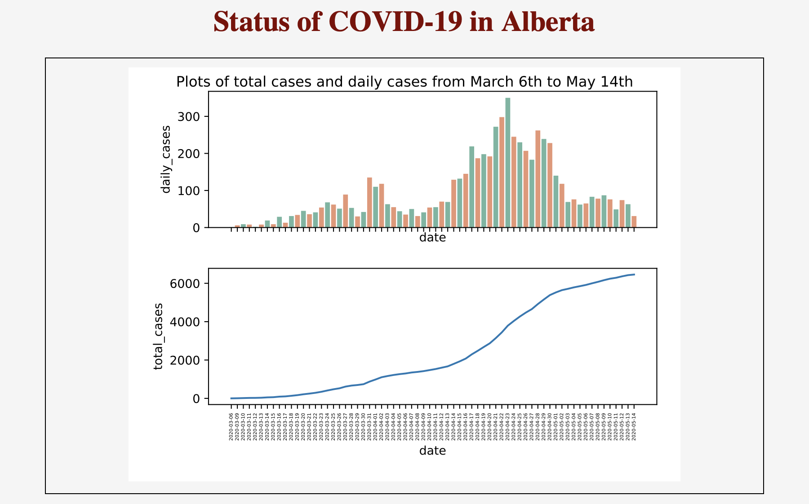
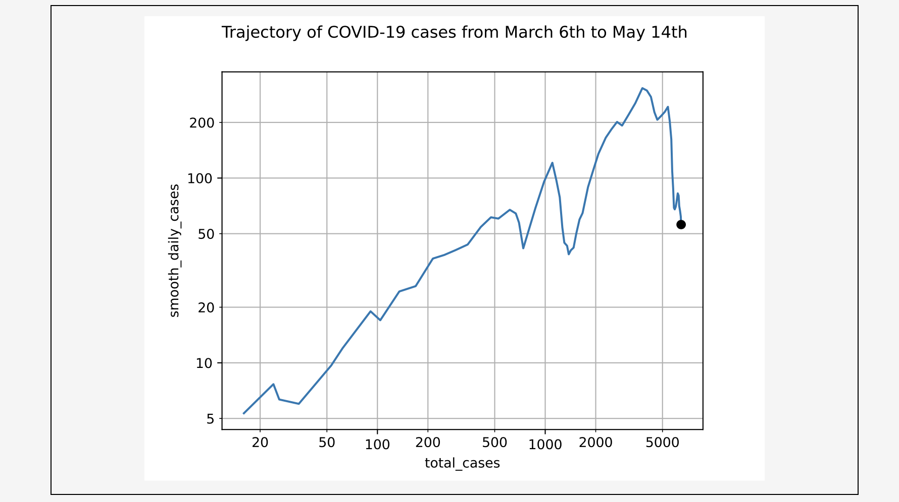

# COVID-19 Data Visualization Tool 
Author: Benjamin Lokanc

## Introduction 

This is a Local web application built with python using flask, pandas, seaborn, matplotlib, and sqlalchemy to visualize the number of cases of COVID-19 in Alberta.
This was built by myself to test my data analysis tools and to experiment with creating local web applications with flask. 

## Preprocessing of Data

Data was downloaded from https://www.alberta.ca/stats/covid-19-alberta-statistics.htm in CSV format to be processed. 

Using python library 'csv' the data was processed and converted into a dataframe with 2 columns:
- 'date'
- 'daily_cases' 

Using sqlalchemy, the dataframe was stored in an sql database. 

## Modes of Data analysis 

There are two major figures produced to visualize the data.

The first figure is two subplots, the first being the number of daily cases reported, the second being total lifetime cases.

The second figure is a log-log plot of daily cases versus total cases. This is used as a measure to see how well the province is combating the virus. This is further described in the YouTube video by minute physics, [How To Tell If We're Beating COVID-19](https://youtu.be/54XLXg4fYsc).

## Web Application 
### Web Application Design

The style sheet and template were designed by myself using CSS and HTML respectively. 

### Running the Web Appplication 

When downloaded, navigate to the directory this project is stored in and run '$python3 covidWebApp.py'. Open the browser of your choice and type 'localhost:5000', press enter and the web application will display. 

### Screenshots of the Web Application
Example of the web application using data from March 6th to May 14th:

